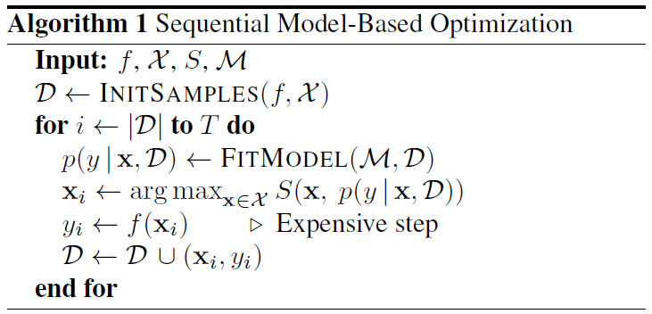

# Bayesian Optimization for MPPI Control of Robot Arm Planar Pushing

## Quick Start

1. Install all necessary dependencies using `bash install.sh`.
2. Run our demo using `python demo.py`. 
   Instructions and results will be printed in the terminal and a live pushing demo should show up in pybullet GUI.

## Dependencies

- Python >= 3.8
- PyTorch >= 1.11
- GPytorch >= 1.9.1
- cma >= 3.3.0
- bayesian-optimization >= 1.4.2

## Reference
**BOA Algorithm**

> f: objective function  
> X: support of variables  
> S: acquisition function  
> M: GP model  
> D: dataset  
> x: variable  
> y: observation  

**Github Repository**
- [Bayesian machine learning notebooks](https://github.com/krasserm/bayesian-machine-learning) 1.6k
- [Python implementation of bayesian global optimization](https://github.com/fmfn/BayesianOptimization) 6.6k
- [BoTorch](https://github.com/pytorch/botorch) 2.6k
- [GPyTorch](https://github.com/cornellius-gp/gpytorch) 3k
- [pycma](https://github.com/CMA-ES/pycma)

**Others**
- [Bayesian optimization wiki](https://en.wikipedia.org/wiki/Bayesian_optimization)
- [Example blog](https://gdmarmerola.github.io/ts-for-bayesian-optim/)
