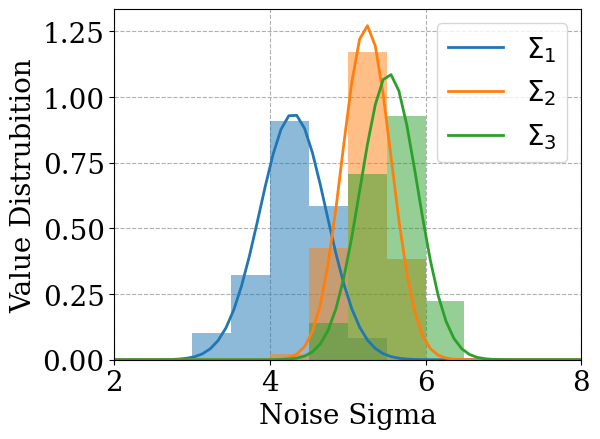
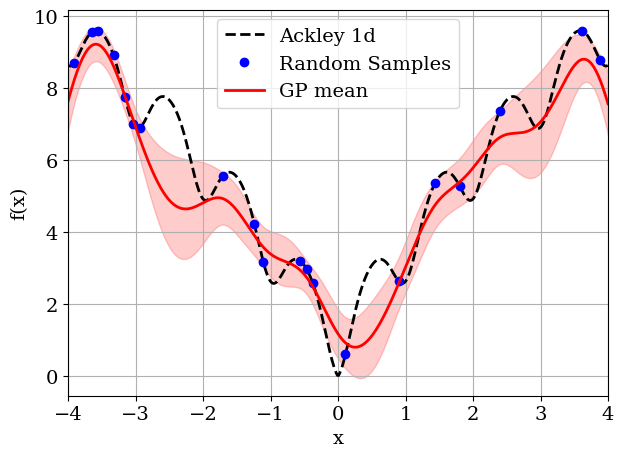
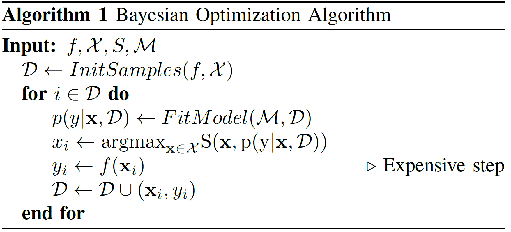
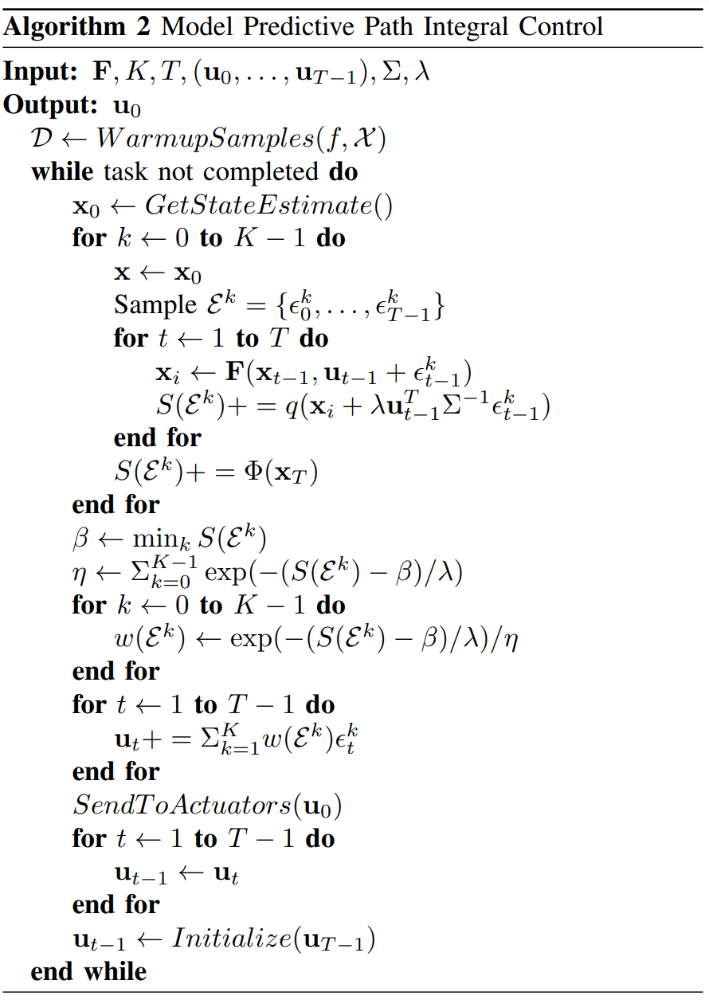

# Bayesian Optimization for MPPI Planar Pushing

In this project, we implement the Bayesian Optimization Algorithm (BOA) for autotuning the hyperparameters of Model Predictive Path Integral (MPPI) control to solve a planar box pushing task with non-trivial obstacles.

## Quick Start

1. Install all necessary dependencies using `bash install.sh`.
2. Run our demo using `python demo.py`. 
   Instructions and results will be printed in the terminal and a live pushing demo should show up in pybullet GUI.

## API for Easy BOA Application
This implementation provides an easy-to-use Bayesian optimizer with full GPU pipeline support. The optimization results are at least comparable to the most popular BOA implementation in python.

Check [here](https://github.com/silvery107/bayesian-opt-gpytorch/blob/078caf3534b1f92a9d2d2cc7d2d135b08fa8db8d/optimizer/panda_pushing_optimizer.py#L123) for more details.

## Dependencies

- Python >= 3.8
- [PyTorch >= 1.11](https://pytorch.org/get-started/previous-versions/)
- [GPytorch >= 1.9.1](https://github.com/cornellius-gp/gpytorch)

## Reference
**BOA**

> f: objective function  
> X: support of variables  
> S: acquisition function  
> M: GP model  
> D: dataset  
> x: variable  
> y: observation  

**MPPI**

